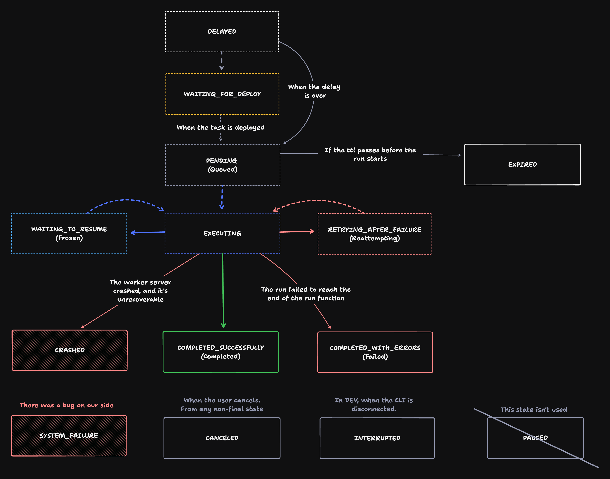

# Task Processing Engine (TPE) v2

The TPE is what takes a run from triggered through to finished.

It uses:

- The queue
- The run and attempt states
- Heartbeats
- Workers
- Checkpoints

## Goals

We need to:

- Improve reliability
  - Currently 1.5/1000 runs end in `SYSTEM_FAILURE`.
  - We have permanently frozen runs every day.
- Have strong transactional guarantees / eliminate race conditions
  - Postgres and Redis can get out of sync.
  - It's possible for two things to do stuff to a run at once.
- Add regression tests
  - We should get more confident over time when shipping changes.
- Improve observability
  - We should be able to see exactly what happened to a run.

## Proposals

### 1. Use `RedLock` to lock runs when they are modified

[RedLock](https://github.com/mike-marcacci/node-redlock?tab=readme-ov-file#usage) is an implementation of distributed locks. It will allow us to lock a run and prevent two things from modifying a run (and related things) at the same time.

- All operations on a run should be wrapped in a lock, with lock retries.
- There's a timeout (which can be extended inside the code) to prevent permanent locks.
- Each completed operation would create an entry in the `TaskRunState` table (point 2 below).
- Allows transactional safety for Postgres, Redis and other future things tied to a run.

### 2. Add a `TaskRunState` table

Every time a run changes "state" a row would be written. A state is more than just the run.status column, it can be other things like an attempt.

- Heartbeats and checkpoints would be tied to a run state.
  - A heartbeat would have a `TaskRunState` id. If that state is old it's ignored.
  - A checkpoint would be tied to the last `TaskRunState` id. If it is old it's ignored. If it's the latest then we'd create a new `TaskRunState` row with the checkpoint attached.
- It provides great observability.
  - We can see exactly what happened to a run.
  - We can see the order of events.
  - In the future, we could replay from a certain point for debugging.

| id            | number | runId          | runStatus              | attemptId    | attemptStatus | timestamp             | environmentId  | waitingOn      | checkpointId   |
| ------------- | ------ | -------------- | ---------------------- | ------------ | ------------- | --------------------- | -------------- | -------------- | -------------- |
| cltsg5660002l | 1      | cltraqewq006z7 | PENDING                | null         | null          | 2024-08-27T18:48:102Z | clenvqewq006z7 | null           | null           |
| cltran2qw002u | 2      | cltraqewq006z7 | EXECUTING              | null         | null          | 2024-08-27T18:48:251Z | clenvqewq006z7 | null           | null           |
| cltsglcut000v | 3      | cltraqewq006z7 | EXECUTING              | cltsyyt3o001 | EXECUTING     | 2024-08-27T18:48:862Z | clenvqewq006z7 | null           | null           |
| cltswhj9n0005 | 4      | cltraqewq006z7 | WAITING_TO_RESUME      | cltsyyt3o001 | EXECUTING     | 2024-08-27T18:51:319Z | clenvqewq006z7 | cltsfxzzd001c3 | null           |
| cltswdkoo0001 | 5      | cltraqewq006z7 | WAITING_TO_RESUME      | cltsyyt3o001 | PAUSED        | 2024-08-27T18:52:169Z | clenvqewq006z7 | cltsfxzzd001c3 | cltswdkrd001j7 |
| cltyaltde001h | 6      | cltraqewq006z7 | EXECUTING              | cltsyyt3o001 | EXECUTING     | 2024-08-27T18:57:169Z | clenvqewq006z7 | null           | null           |
| cltyb0z9e001j | 7      | cltraqewq006z7 | COMPLETED_SUCCESSFULLY | cltsyyt3o001 | COMPLETED     | 2024-08-27T18:59:639Z | clenvqewq006z7 | null           | null           |

I think we should also add a `TaskRunStateFailed` table. It would be very similar but used to store transitions that failed (e.g. a checkpoint arrives too late, which isn't a bug, but wouldn't be a valid state). This would be purely for debugging reasons.

### 3. Add a simple state machine

The states a run can be in (along with the current attempt) are quite complicated.

I am NOT suggesting we build a heavy state machine. Just a simple way to check if the run is allowed to move to the new state.

It would be used inside any of the `TaskRunTransitionServices`, and would simply return whether the transition is allowed or not, with an error if it's not. Some states like `CANCELED` are possible from any state, but most are not.

### 4. Add a `TaskRunTransitionService` for each state transition

Our existing code is scattered for interacting with runs. We should move it all into one folder and make each service inherit from a common base class that:

- Would create a RedLock (and retry if the lock fails to be acquired).
- Check the transition is valid (by trying to transition from the old to the new states in the state machine).
- Have tracing.
- Store the new state in the `TaskRunState` table, or `TaskRunStateFailed` if it fails.

Largely we would just copy paste the existing code from services like `TriggerTaskService` with very few modifications.

### 5. Queue changes

- With the `TaskRunState` table we don't need message payloads in the queue anymore.
- Add a `requeue()` function
  - It would upsert the run ID with a timestamp.
  - Would be used for `wait.for()`, reattempts, etc.
  - Could be used in some error cases if a run fails to start, etc.

### 6. Checkpoints become optional

- They're an optimisation so we can save compute.
- They are important for long waits so we don't have lots of workers just say there doing nothing.

Process to provide strong guarantees:

1. Workers would create the checkpoint using the `id` of the last `TaskRunState` row.
2. It would send the checkpoint data to the platform.
3. The platform would try and create an entry in the `TaskRunState` table (with a RedLock), which would only succeed if the last `TaskRunState` row has the same `id` as the checkpoint.
4. Only if this succeeds and the platform responds with success can the worker shutdown.

### 7. Heartbeats

- They are tied to a `TaskRunState` row.
- If they try to fail a run we check that their `TaskRunState` ID is the latest.
- High CPU breaks the heartbeats (and usage requests)
  - We should run them in a JS `Worker` (using `worker_threads`).
  - This prevents main thread blockages from affecting the heartbeats.
  - [BullMQ has the option to do this](https://docs.bullmq.io/guide/jobs/stalled).
  - If this works we should send the usage data in the same way.

### 8. Tests

Unit tests:

- Very simple and fast synchronous tests for the state machine, to check only valid transitions are allowed.

Integration tests:

- Use [Test Containers](https://testcontainers.com/) for this.
  - Start with simple tests for the `TaskRunTransitionServices`.
  - Add regression tests as we go.
  - Test situations where we try and do two things at once and verify the locks work.

E2E tests:

Not sure how to do this but we should aim to have:

- Some test tasks that can be run in a test environment.
- Check the Redis and Postgres state after each run.

Potentially this could be a v3 project that has a master task that triggers all the others and verifies each using the API.

### 9. Make Dev and Prod behave more similarly

- The same transitions using `TaskRunTransitionServices`.
- The same behaviour with concurrency, e.g. releasing it when using triggerAndWait.

It's currently very easy to break DEV or PROD because a change needs to be made in both places. I did this last week. Fewer code paths = more consistency = more reliability.

More importantly it's better for users because Prod will behave as they expect, e.g. their concurrency limits won't be a surprise.

There are a few critical differences though:

- DEV pulls from it's queue.
- Set a sensible default concurrency limit for DEV, e.g. 10.
- Don't create checkpoint in DEV. Now they're optional, this is fine.
- Don't report usage ($$$) for DEV runs.

### 10. Queue performance improvements

BullMQ is "polling-free". This allows higher throughput and lower latency. We should look at how they do this.
